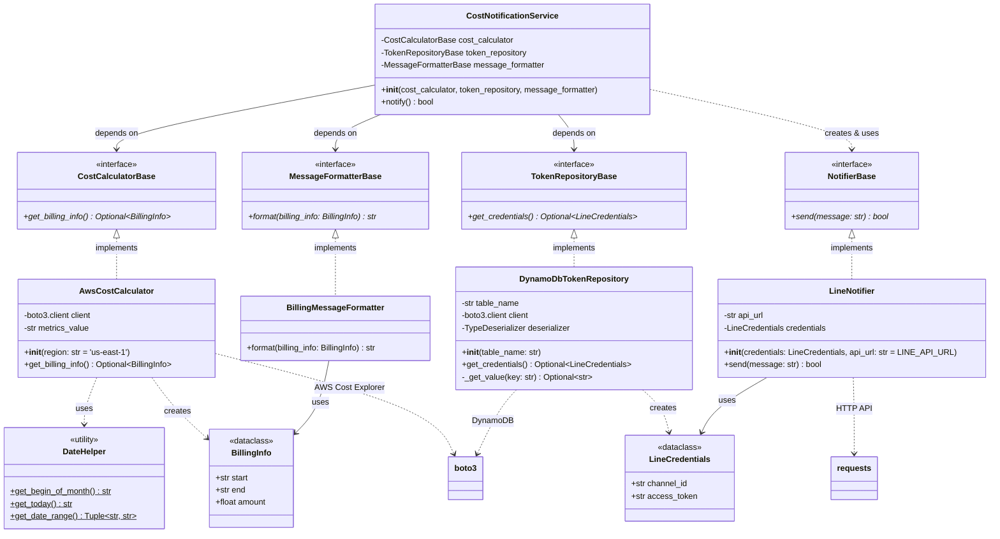

```mermaid
classDiagram
    %% Data Models
    class BillingInfo {
        <<dataclass>>
        +str start
        +str end
        +float amount
    }
    
    class LineCredentials {
        <<dataclass>>
        +str channel_id
        +str access_token
    }
    
    %% Interfaces (Base Classes)
    class CostCalculatorBase {
        <<interface>>
        +get_billing_info()* Optional~BillingInfo~
    }
    
    class TokenRepositoryBase {
        <<interface>>
        +get_credentials()* Optional~LineCredentials~
    }

    class NotifierBase {
        <<interface>>
        +send(message: str)* bool
    }

    class MessageFormatterBase {
        <<interface>>
        +format(billing_info: BillingInfo)* str
    }
    
    %% Utility Class
    class DateHelper {
        <<utility>>
        +get_begin_of_month()$ str
        +get_today()$ str
        +get_date_range()$ Tuple~str, str~
    }
    
    %% Implementation Classes
    class AwsCostCalculator {
        -boto3.client client
        -str metrics_value
        +__init__(region: str = 'us-east-1')
        +get_billing_info() Optional~BillingInfo~
    }
    
    class DynamoDbTokenRepository {
        -str table_name
        -boto3.client client
        -TypeDeserializer deserializer
        +__init__(table_name: str)
        +get_credentials() Optional~LineCredentials~
        -_get_value(key: str) Optional~str~
    }
    
    class BillingMessageFormatter {
        +format(billing_info: BillingInfo) str
    }
    
    class LineNotifier {
        -str api_url
        -LineCredentials credentials
        +__init__(credentials: LineCredentials, api_url: str = LINE_API_URL)
        +send(message: str) bool
    }
    
    %% Application Service
    class CostNotificationService {
        -CostCalculatorBase cost_calculator
        -TokenRepositoryBase token_repository
        -MessageFormatterBase message_formatter
        +__init__(cost_calculator, token_repository, message_formatter)
        +notify() bool
    }
    
    %% Interface Implementation
    CostCalculatorBase <|.. AwsCostCalculator : implements
    TokenRepositoryBase <|.. DynamoDbTokenRepository : implements
    MessageFormatterBase <|.. BillingMessageFormatter : implements
    NotifierBase <|.. LineNotifier : implements
    
    %% Dependency Injection (DIP)
    CostNotificationService --> CostCalculatorBase : depends on
    CostNotificationService --> TokenRepositoryBase : depends on
    CostNotificationService --> MessageFormatterBase : depends on
    CostNotificationService ..> NotifierBase : creates & uses
    
    %% Data Flow
    AwsCostCalculator ..> DateHelper : uses
    AwsCostCalculator ..> BillingInfo : creates
    DynamoDbTokenRepository ..> LineCredentials : creates
    BillingMessageFormatter --> BillingInfo : uses
    LineNotifier --> LineCredentials : uses
    
    %% External Dependencies
    AwsCostCalculator ..> boto3 : AWS Cost Explorer
    DynamoDbTokenRepository ..> boto3 : DynamoDB
    LineNotifier ..> requests : HTTP API
```
